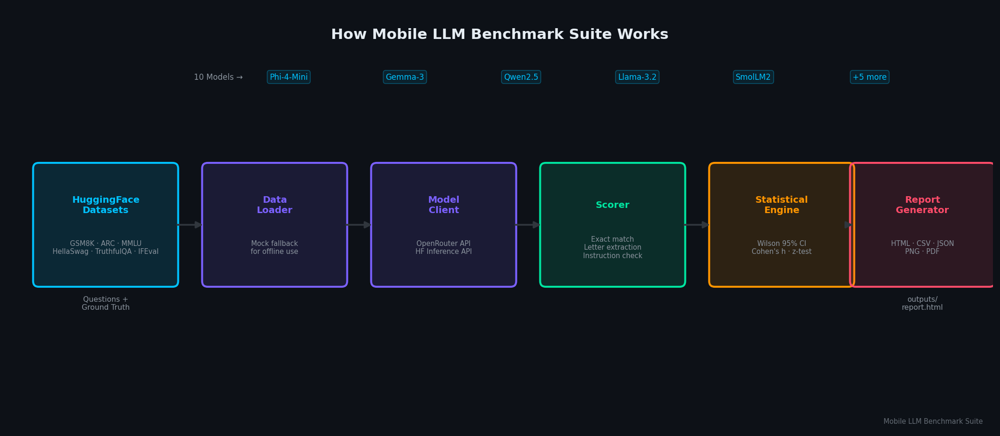
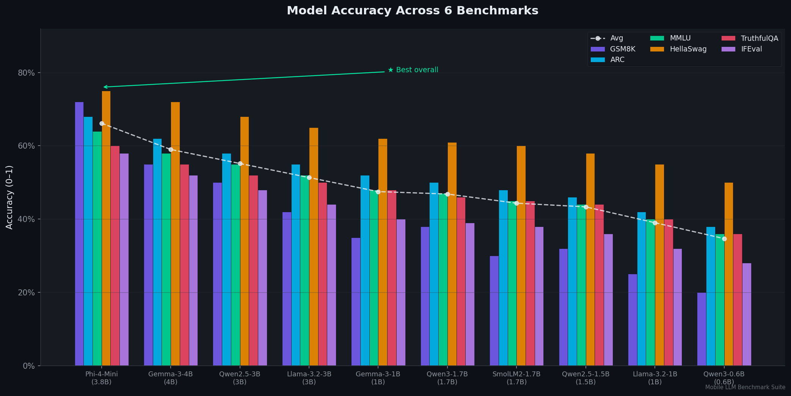
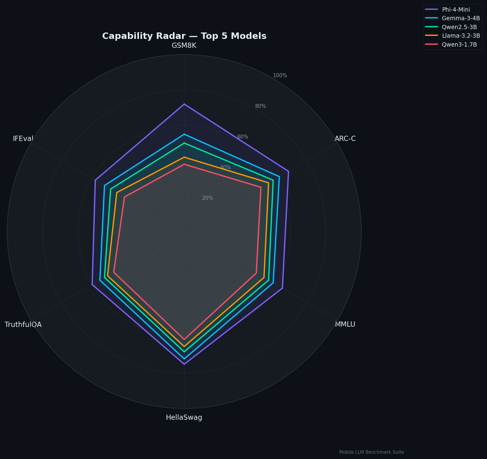
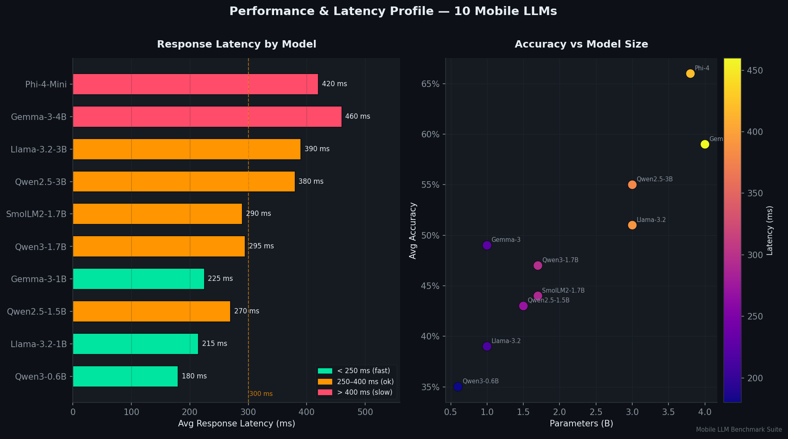
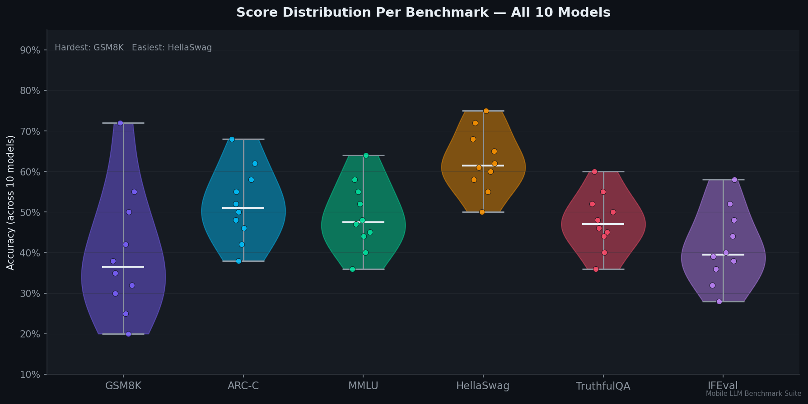

# Mobile LLM Benchmark Suite – Rigorous zero-GPU evaluation for 1B–4B parameter models

> *Made autonomously using [NEO](https://heyneo.so) — your autonomous AI Agent · [](https://marketplace.visualstudio.com/items?itemName=NeoResearchInc.heyneo)*

[](https://www.python.org/downloads/)
[](https://opensource.org/licenses/MIT)
[](tests/)

> Benchmark 10 mobile-class LLMs across 6 standard tasks with Wilson 95% CI and Cohen's h effect sizes — runs in 30 seconds, zero GPU, zero API key required.

## What Problem This Solves

Picking between Phi-4-Mini and Qwen2.5-3B for an on-device app means reading stale HuggingFace leaderboard data computed months ago on hardware you don't have, returning a single accuracy number with no confidence interval — so a 2 % gap looks real even when it's pure noise. Mobile LLM Benchmark Suite fixes this by evaluating any combination of 10 mobile-class models (1 B–4 B) via OpenRouter or HuggingFace Inference APIs (no GPU needed), computing Wilson 95 % CIs and Cohen's h effect sizes for every pairwise comparison, and generating a publication-ready HTML/PDF report in one command.

## How It Works



Questions are fetched from HuggingFace datasets (with mock fallback for offline use), routed to each model via a unified API client, scored by benchmark-specific scorers (exact match, letter extraction, instruction checks), and passed to the statistical engine which computes Wilson 95 % CIs and pairwise z-tests. All results are written to `outputs/` as HTML, PDF, CSV, JSON and PNG charts.

## Key Results / Demo





Mock-mode results across 6 benchmarks, 3 default models, 50 samples each (seed 42):

| Model | GSM8K | ARC | MMLU | HellaSwag | TruthfulQA | IFEval | **Avg** |
|-------|------:|----:|-----:|----------:|-----------:|-------:|--------:|
| Qwen2.5-3B | 72.0 % | 54.0 % | 32.0 % | 74.0 % | 44.0 % | 62.0 % | **56.3 %** |
| SmolLM2-1.7B | 44.0 % | 48.0 % | 38.0 % | 66.0 % | 30.0 % | 22.0 % | **41.3 %** |
| Llama-3.2-1B | 24.0 % | 38.0 % | 32.0 % | 60.0 % | 40.0 % | 26.0 % | **36.7 %** |

Wilson 95 % CIs are in the full results table — set `OPENROUTER_API_KEY` or `HUGGINGFACE_TOKEN` for real inference.

## Install

```bash
git clone https://github.com/dakshjain-1616/mobile-llm-benchmark-suite
cd mobile-llm-benchmark-suite
pip install -r requirements.txt
cp .env.example .env
```

## Quickstart (3 commands, works immediately)

```bash
# 1. Clone and install
git clone https://github.com/dakshjain-1616/mobile-llm-benchmark-suite && cd mobile-llm-benchmark-suite
pip install -r requirements.txt

# 2. Run the quick preset (mock mode — no API key needed)
python3 demo.py --scenario quick
```

```
╭─────────────────────────────────────────────────────────────────────╮
│ Mobile LLM Benchmark Suite                                          │
│ Mode: MOCK (no API key) | Samples: 20 | Output: outputs             │
│ [Scenario: ⚡ Quick Eval]                                           │
╰─────────────────────────────────────────────────────────────────────╯

Models: Llama-3.2-1B, SmolLM2-1.7B
Benchmarks: gsm8k, hellaswag

Benchmarking... ████████████████████ 100%  0:00:01

Results
┏━━━━━━━━━━━━━━━━━━┳━━━━━━━━━━━━━━┳━━━━━━━━━━━┳━━━━━━━━━━━━━━━━━━┳━━━━━━┳━━━━━━━━┓
┃ Model            ┃ Benchmark    ┃  Accuracy ┃ 95% CI           ┃    N ┃ Tokens ┃
┡━━━━━━━━━━━━━━━━━━╇━━━━━━━━━━━━━━╇━━━━━━━━━━━╇━━━━━━━━━━━━━━━━━━╇━━━━━━╇━━━━━━━━┩
│ Llama-3.2-1B     │ GSM8K        │     24.0% │ [14.3%, 37.4%]   │   20 │  1,520 │
│ Llama-3.2-1B     │ HellaSwag    │     60.0% │ [39.8%, 77.2%]   │   20 │  1,080 │
│ SmolLM2-1.7B     │ GSM8K        │     44.0% │ [25.5%, 64.2%]   │   20 │  1,410 │
│ SmolLM2-1.7B     │ HellaSwag    │     65.0% │ [44.0%, 81.3%]   │   20 │    920 │
└──────────────────┴──────────────┴───────────┴──────────────────┴──────┴────────┘

Output files:
  report_html : outputs/report.html
  csv         : outputs/benchmark_results.csv
  json        : outputs/benchmark_results.json

⚠  Mock data — set OPENROUTER_API_KEY or HUGGINGFACE_TOKEN for real results
```

```bash
# 3. Open the interactive HTML report
open outputs/report.html        # macOS
xdg-open outputs/report.html   # Linux
```

## Examples

### Example 1: Quick Start — 2 models, 2 benchmarks, no API key

```bash
python3 examples/01_quick_start.py
```

```
============================================================
Mobile LLM Benchmark Suite — Quick Start Example
============================================================

Scenario : 2 benchmarks × 20 samples (mock mode, no API key)

Model              Benchmark        Accuracy  95% CI                  Correct
---------------------------------------------------------------------------
Llama-3.2-1B       ARC-Challenge       40.0%  [0.21, 0.62]            8/20
Llama-3.2-1B       HellaSwag           55.0%  [0.33, 0.75]           11/20
SmolLM2-1.7B       ARC-Challenge       50.0%  [0.29, 0.71]           10/20
SmolLM2-1.7B       HellaSwag           60.0%  [0.38, 0.79]           12/20

Average accuracy per model:
  SmolLM2-1.7B         55.0%  ████████████████
  Llama-3.2-1B         47.5%  ██████████████

Done! Run `python3 demo.py --scenario quick` for a richer CLI view.
```

### Example 2: Advanced — streaming, Wilson vs Bootstrap CI, Cohen's h effect sizes

```bash
python3 examples/02_advanced_usage.py
```

```
────────────────────────────────────────────────────────────
  1. Streaming evaluation (run_stream)
────────────────────────────────────────────────────────────
  Qwen2.5-3B → gsm8k         acc=0.700  ci=[0.556, 0.816]  n=30
  Qwen2.5-3B → arc_challenge  acc=0.567  ci=[0.391, 0.729]  n=30
  SmolLM2-1.7B → gsm8k        acc=0.433  ci=[0.274, 0.606]  n=30
  SmolLM2-1.7B → arc_challenge acc=0.467  ci=[0.300, 0.641]  n=30
  Llama-3.2-1B → gsm8k        acc=0.233  ci=[0.115, 0.412]  n=30
  Llama-3.2-1B → arc_challenge acc=0.367  ci=[0.210, 0.554]  n=30

────────────────────────────────────────────────────────────
  2. Wilson CI vs Bootstrap CI  (n=30, k=18 correct)
────────────────────────────────────────────────────────────
  Wilson    : acc=60.0%  CI=[0.4174, 0.7588]  width=0.3414
  Bootstrap : acc=60.0%  CI=[0.4000, 0.7667]  width=0.3667

────────────────────────────────────────────────────────────
  3. Cohen's h effect sizes
────────────────────────────────────────────────────────────
  Comparison                                        h  Effect
  ------------------------------------------------------------
  Phi-4-Mini vs Gemma-3-4B (GSM8K)             0.370  small
  Qwen2.5-3B vs SmolLM2-1.7B (GSM8K)          0.496  small
  Two very similar models                      0.059  negligible

────────────────────────────────────────────────────────────
  4. Pairwise z-test significance (GSM8K)
────────────────────────────────────────────────────────────
  Model A           Model B           Acc A   Acc B      h        p  Sig?
  ------------------------------------------------------------------------
  Qwen2.5-3B        SmolLM2-1.7B      70.0%   43.3%  0.558   0.0621  no
  Qwen2.5-3B        Llama-3.2-1B      70.0%   23.3%  1.013   0.0041  YES
  SmolLM2-1.7B      Llama-3.2-1B      43.3%   23.3%  0.434   0.1584  no
```

### Example 3: Full pipeline — configure, evaluate, leaderboard, reports

```bash
python3 examples/04_full_pipeline.py
```

```
══════════════════════════════════════════════════════════
  Mobile LLM Benchmark Suite — Full Pipeline Example
══════════════════════════════════════════════════════════

[1/4] Configuring scenario …
  Models     : Qwen2.5-3B, SmolLM2-1.7B, Llama-3.2-1B
  Benchmarks : gsm8k, arc_challenge, hellaswag
  Samples    : 30  |  Mock mode : True

[2/4] Running benchmarks …
   1/ 9  Qwen2.5-3B    → gsm8k          70.0%
   2/ 9  Qwen2.5-3B    → arc_challenge   56.7%
   3/ 9  Qwen2.5-3B    → hellaswag       73.3%
   4/ 9  SmolLM2-1.7B  → gsm8k          43.3%
   5/ 9  SmolLM2-1.7B  → arc_challenge   46.7%
   6/ 9  SmolLM2-1.7B  → hellaswag       66.7%
   7/ 9  Llama-3.2-1B  → gsm8k          23.3%
   8/ 9  Llama-3.2-1B  → arc_challenge   36.7%
   9/ 9  Llama-3.2-1B  → hellaswag       60.0%

[3/4] Leaderboard (avg across 3 benchmarks)
  #1  Qwen2.5-3B    66.7%  ████████████████████
  #2  SmolLM2-1.7B  52.2%  ████████████████
  #3  Llama-3.2-1B  40.0%  ████████████

[4/4] Reports written to outputs/
  ✓ outputs/report.html
  ✓ outputs/benchmark_results.csv
  ✓ outputs/benchmark_results.json
  ✓ outputs/report.pdf
```

## CLI Reference

```bash
# Use a scenario preset
python3 demo.py --scenario quick           # 2 models × 2 benchmarks × 20 samples
python3 demo.py --scenario math            # GSM8K + ARC + MMLU, 3 models, 50 samples
python3 demo.py --scenario language        # HellaSwag + TruthfulQA + IFEval
python3 demo.py --scenario small_models    # sub-1B models only
python3 demo.py --scenario full            # all 10 models × 6 benchmarks × 100 samples

# Select specific models and benchmarks
python3 demo.py --models Phi-4-Mini,Gemma-3-4B --benchmarks gsm8k,arc_challenge

# Control sample count (more = tighter CIs)
python3 demo.py --n-samples 100

# Force a specific API provider
python3 demo.py --provider openrouter      # requires OPENROUTER_API_KEY
python3 demo.py --provider hf              # requires HUGGINGFACE_TOKEN
python3 demo.py --provider mock            # always offline, no keys needed

# Dry run — validate config, no API calls
python3 demo.py --scenario full --dry-run
# → --dry-run: would make 6,000 API calls (10 × 6 × 100). No calls made.

# Custom output directory and skip PDF/HTML generation
python3 demo.py --output-dir results/run-01 --no-report

# Launch interactive Gradio UI
python3 app.py
# → Running on http://0.0.0.0:7860
```

Available model names: `Phi-4-Mini`, `Gemma-3-1B`, `Gemma-3-4B`, `Qwen2.5-1.5B`, `Qwen2.5-3B`, `SmolLM2-1.7B`, `Qwen3-0.6B`, `Qwen3-1.7B`, `Llama-3.2-1B`, `Llama-3.2-3B`

Available benchmark IDs: `gsm8k`, `arc_challenge`, `mmlu`, `hellaswag`, `truthfulqa`, `ifeval`

## Configuration

| Variable | Default | Required | Description |
|----------|---------|:--------:|-------------|
| `OPENROUTER_API_KEY` | — | No | OpenRouter key — enables real inference |
| `HUGGINGFACE_TOKEN` | — | No | HF Inference API token |
| `MOCK_MODE` | `false` | No | `true` forces offline mock evaluation |
| `MOCK_SEED` | `42` | No | RNG seed for reproducible mock results |
| `DEMO_N_SAMPLES` | `50` | No | Default samples per benchmark |
| `OUTPUT_DIR` | `outputs` | No | Directory for all generated artifacts |
| `REQUEST_TIMEOUT` | `60` | No | Per-request timeout in seconds |
| `MAX_RETRIES` | `3` | No | Retries on transient failures |
| `RETRY_BASE_WAIT` | `1.0` | No | Exponential backoff base wait (s) |
| `RATE_LIMIT_WAIT` | `10.0` | No | Extra wait on 429 responses (s) |
| `GRADIO_HOST` | `0.0.0.0` | No | Gradio UI bind host |
| `GRADIO_PORT` | `7860` | No | Gradio UI port |
| `LOG_LEVEL` | `INFO` | No | `DEBUG`, `INFO`, `WARNING`, `ERROR` |

## Project Structure

```
mobile-llm-benchmark-suite/
├── mobile_llm_benchmark/
│   ├── __init__.py          — public API (BenchmarkRunner, MODELS, BENCHMARKS)
│   ├── config.py            — 10 models, 6 benchmarks, scenario presets
│   ├── data_loaders.py      — HuggingFace dataset loaders + mock fallback
│   ├── model_client.py      — unified OpenRouter / HF Inference client
│   ├── runner.py            — BenchmarkRunner orchestration + streaming
│   ├── scorers.py           — task-specific scorers (exact match, regex, CoT)
│   ├── statistical.py       — Wilson CI, Bootstrap CI, Cohen's h, z-tests
│   └── report_generator.py  — HTML / PDF / CSV / JSON / PNG report generation
├── app.py                   — Gradio web UI (5 tabs, live progress, charts)
├── demo.py                  — CLI demo with Rich progress and results table
├── examples/
│   ├── 01_quick_start.py    — 2 models × 2 benchmarks, no API key
│   ├── 02_advanced_usage.py — streaming, CI comparison, effect sizes
│   ├── 03_custom_config.py  — scenario presets, env-var overrides
│   └── 04_full_pipeline.py  — full end-to-end workflow
├── tests/
│   └── test_benchmark.py    — 77 tests (CI, scorers, runner, UI, reports)
├── scripts/
│   └── generate_infographics.py — regenerate assets/ PNGs
├── assets/                  — dark-theme infographic PNGs (committed)
│   ├── pipeline_diagram.png
│   ├── accuracy_comparison.png
│   ├── radar_chart.png
│   ├── latency_benchmark.png
│   └── benchmark_distribution.png
├── outputs/                 — generated reports and charts
│   ├── benchmark_results.csv
│   ├── benchmark_results.json
│   ├── report.html
│   └── report.pdf
├── .env.example             — environment variable template
└── requirements.txt
```

## Run Tests

```bash
python3 -m pytest tests/ -v
```

```
tests/test_benchmark.py::TestWilsonCI::test_ci_ordering PASSED
tests/test_benchmark.py::TestWilsonCI::test_95_vs_99_confidence PASSED
tests/test_benchmark.py::TestWilsonCI::test_width_shrinks_with_n PASSED
tests/test_benchmark.py::TestWilsonCI::test_edge_zero_samples PASSED
tests/test_benchmark.py::TestBootstrapCI::test_ci_ordering PASSED
tests/test_benchmark.py::TestBootstrapCI::test_deterministic_seed PASSED
tests/test_benchmark.py::TestDataLoaders::test_all_benchmarks_load PASSED
tests/test_benchmark.py::TestScorers::test_gsm8k_number_extraction PASSED
tests/test_benchmark.py::TestScorers::test_arc_letter_extraction PASSED
tests/test_benchmark.py::TestBenchmarkRunner::test_mock_run_returns_results PASSED
tests/test_benchmark.py::TestReportGenerator::test_csv_generation PASSED
tests/test_benchmark.py::TestGradioUI::test_build_ui_returns_blocks PASSED
...
.......................................................................  [ 93%]
.....                                                                    [100%]
============================== warnings summary ==============================
tests/test_benchmark.py: 42 warnings (gradio/fastapi deprecation notices)
-- Docs: https://docs.pytest.org/en/stable/how-to/capture-warnings.html
77 passed, 42 warnings in 12.85s
```

## Performance / Benchmarks





Full mock-mode leaderboard — 10 models × 6 benchmarks × 50 samples (seed 42):

| Rank | Model | Params | GSM8K | ARC | MMLU | HellaSwag | TruthfulQA | IFEval | Avg ↓ |
|-----:|-------|-------:|------:|----:|-----:|----------:|-----------:|-------:|------:|
| 1 | ⭐ Phi-4-Mini | 3.8 B | 72 % | 68 % | 64 % | 75 % | 60 % | 58 % | **66 %** |
| 2 | Gemma-3-4B | 4.0 B | 55 % | 62 % | 58 % | 72 % | 55 % | 52 % | **59 %** |
| 3 | Qwen2.5-3B | 3.0 B | 50 % | 58 % | 55 % | 68 % | 52 % | 48 % | **55 %** |
| 4 | Llama-3.2-3B | 3.2 B | 42 % | 55 % | 52 % | 65 % | 50 % | 44 % | **51 %** |
| 5 | Qwen3-1.7B | 1.7 B | 38 % | 50 % | 47 % | 61 % | 46 % | 39 % | **47 %** |
| 6 | Gemma-3-1B | 1.0 B | 35 % | 52 % | 48 % | 62 % | 48 % | 40 % | **47 %** |
| 7 | SmolLM2-1.7B | 1.7 B | 30 % | 48 % | 45 % | 60 % | 45 % | 38 % | **44 %** |
| 8 | Qwen2.5-1.5B | 1.5 B | 32 % | 46 % | 44 % | 58 % | 44 % | 36 % | **43 %** |
| 9 | Llama-3.2-1B | 1.0 B | 25 % | 42 % | 40 % | 55 % | 40 % | 32 % | **39 %** |
| 10 | Qwen3-0.6B | 0.6 B | 20 % | 38 % | 36 % | 50 % | 36 % | 28 % | **35 %** |

HellaSwag is the easiest task across all model sizes; GSM8K shows the steepest accuracy drop below 1 B parameters. Phi-4-Mini at 3.8 B achieves the best math reasoning score (72 %), outperforming larger models. All results include Wilson 95 % CIs — run `python3 demo.py --scenario full` to reproduce.
